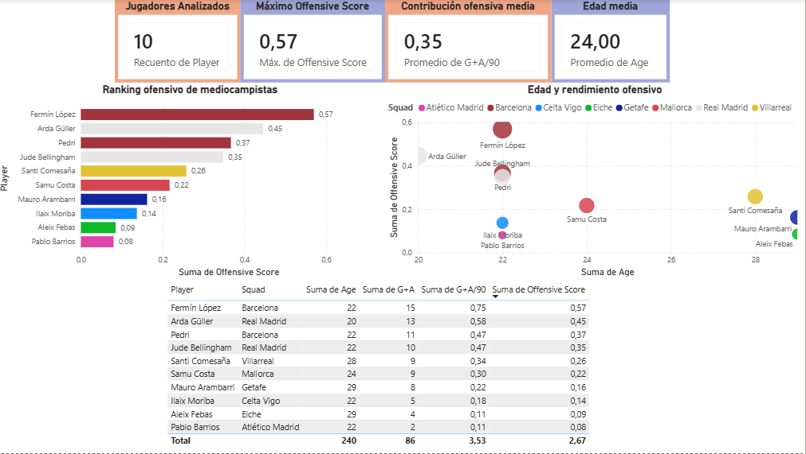

# LaLiga 2025-2026 Scouting Dashboard

## Project Overview

Interactive scouting dashboard developed in Power BI to compare the offensive performance of LaLiga midfielders during the 2025/26 season.

The dashboard allows quick player comparison through custom metrics, visualisations and key performance indicators.

## Dashboard Preview

## Tools Used

- Power BI
- Python
- Pandas
- Microsoft Excel

## Objectives

- Compare player performance.
- Visualise offensive contribution.
- Support scouting and recruitment processes.
- Develop an interactive analytical dashboard.

## Project Status

Completed.

## Author

Marcos Alonso Portela
